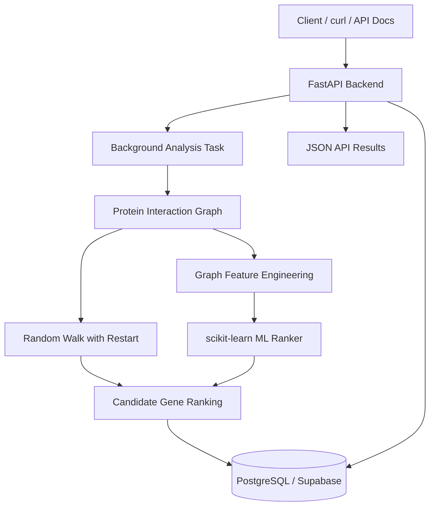

# OncoGraph: Graph-Based Cancer Gene Discovery Pipeline

## Overview
OncoGraph is a backend-focused bioinformatics pipeline that uses protein-protein interaction networks, graph diffusion, statistical validation, and optional graph-based machine learning to prioritize candidate cancer-associated genes from known oncogene seed sets.

The project combines NetworkX-based graph analysis, Random Walk with Restart (RWR), background API processing, optional scikit-learn ranking, and PostgreSQL-backed persistence behind a FastAPI service. The goal is to turn a graph theory research prototype into a more production-style backend/data/ML project that can run locally or in Docker.

This project is for educational and research exploration only. It is not intended for clinical diagnosis, treatment decisions, or medical decision-making.

## Why This Project Matters
Rare mutations may still matter if they are close to important cancer genes in a biological network.

Frequency-only mutation analysis can miss genes that are biologically connected to known cancer drivers but do not appear often across patients. Graph algorithms help surface those functional relationships by looking at how genes interact inside a protein network rather than only how often they are altered.

OncoGraph explores that idea computationally by combining network proximity, statistical comparison against random baselines, and optional ML-based ranking.

## Tech Stack
**Backend**
- FastAPI
- Uvicorn
- Pydantic

**Data / Bioinformatics**
- Python
- NetworkX
- NumPy
- SciPy
- pandas

**ML**
- scikit-learn
- Logistic Regression
- graph feature engineering

**Database**
- PostgreSQL
- SQLAlchemy
- Supabase-ready persistence

**DevOps**
- Docker
- Docker Compose

**Visualization**
- Matplotlib

## Features
- Builds a protein-protein interaction graph from gene interaction data.
- Runs shortest-path analysis between known oncogenes.
- Runs Random Walk with Restart to measure network proximity.
- Compares oncogene proximity against random gene sets.
- Computes p-values for statistical validation.
- Ranks top candidate cancer-associated genes.
- Optional ML ranking using graph features.
- FastAPI endpoints for analysis and result retrieval.
- Background processing for long-running graph simulations.
- PostgreSQL persistence for analysis runs and candidate genes.
- Docker Compose setup with local Postgres.

## System Architecture


## API Endpoints
- `GET /`: Basic service banner confirming the API is running.
- `GET /health`: Lightweight health check for local or containerized deployment.
- `GET /graph/summary`: Returns graph size and seed-gene coverage in the interaction network.
- `POST /analyze`: Starts a background cancer gene analysis run and returns a `run_id`.
- `GET /status/{run_id}`: Returns the current run status (`running`, `completed`, or `failed`).
- `GET /results/{run_id}`: Returns the full analysis result, including scores and ranked genes.
- `GET /genes/top-candidates/{run_id}`: Returns only the top candidate genes for a completed run.

## Example API Usage
Start the API locally:

```bash
python3 -m pip install -r requirements.txt
uvicorn app.main:app --reload
```

Start an analysis:

```bash
curl -X POST http://localhost:8000/analyze \
  -H "Content-Type: application/json" \
  -d '{
    "restart_probability": 0.3,
    "num_steps": 1000,
    "num_random_sets": 20,
    "top_n": 10,
    "use_ml_ranking": false
  }'
```

Check status:

```bash
curl http://localhost:8000/status/YOUR_RUN_ID
```

Get results:

```bash
curl http://localhost:8000/results/YOUR_RUN_ID
```

Use ML ranking:

```bash
curl -X POST http://localhost:8000/analyze \
  -H "Content-Type: application/json" \
  -d '{
    "restart_probability": 0.3,
    "num_steps": 1000,
    "num_random_sets": 20,
    "top_n": 10,
    "use_ml_ranking": true
  }'
```

## Running with Docker
```bash
cp .env.docker.example .env
docker compose up --build
```

Open:

```text
http://localhost:8000/docs
```

Stop:

```bash
docker compose down
```

Reset local database:

```bash
docker compose down -v
```

Docker Compose runs the API and local Postgres.
Results persist across `docker compose down` because of the Postgres volume.
`docker compose down -v` deletes the local database volume.

## Database Persistence
Without `DATABASE_URL`, the app uses in-memory storage.
With `DATABASE_URL`, the app saves analysis runs and candidate genes.

Local Docker uses Postgres by default.
Supabase can be used by setting `DATABASE_URL` to a Supabase Postgres connection string.

Do not commit `.env`.

During development, if you already created older tables before the ML candidate fields were added, use a fresh database or drop and recreate the tables. The current setup uses `create_all()` and does not include migrations yet.

## Graph-Based ML Ranking
Optional mode is activated with `"use_ml_ranking": true`.

The ML ranking layer computes these graph features for each gene:
- RWR score
- degree
- PageRank
- betweenness centrality
- closeness centrality
- shortest path to nearest seed gene
- oncogene neighbor count

It trains a Logistic Regression model using known oncogenes as positive examples and sampled non-oncogenes as negative examples.
The final ranking combines normalized RWR score and ML probability into a single score.

This ML layer is exploratory and educational. It is not a clinical model.

## Example Results
Sample graph summary from current testing:
- `9,039` nodes
- `24,350` edges
- `7` oncogenes found in graph

Sample top candidates from RWR-only mode:
- `CAMLG`
- `TNFRSF13B`
- `COL1A2`
- `MLLT1`
- `COL5A1`

These results may vary slightly depending on simulation settings and random sampling.

## Project Structure
```text
app/
  api/
  core/
  db/
  utils/
data/
outputs/
tests/
Dockerfile
docker-compose.yml
run_pipeline.py
```

## Limitations
- Uses a small curated seed gene list.
- Results depend on the quality and completeness of the interaction network.
- Random Walk simulations can vary slightly.
- ML labels are simplified because seed oncogenes are treated as positive examples.
- Not intended for medical use.

This project is for educational and research exploration only. It is not intended for clinical diagnosis, treatment decisions, or medical decision-making.

## Future Improvements
- Add Alembic migrations.
- Add a React or Next.js dashboard.
- Add authentication for saved runs.
- Add larger cancer gene databases.
- Add real benchmark labels from cancer genomics datasets.
- Add an async task queue with Celery or RQ for heavier runs.
- Add deployment instructions for cloud hosting.

## Resume Highlights
- Built a FastAPI-based bioinformatics backend that runs Random Walk with Restart on protein-protein interaction networks to rank candidate cancer-associated genes.
- Engineered graph-based ML features including PageRank, centrality, shortest-path distance, and RWR proximity to improve candidate gene ranking with scikit-learn.
- Added PostgreSQL persistence, background processing, and Docker Compose support for reproducible long-running analysis workflows.
